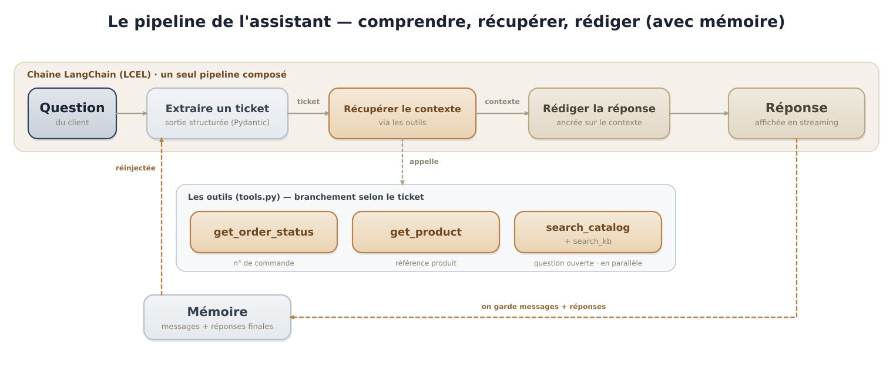
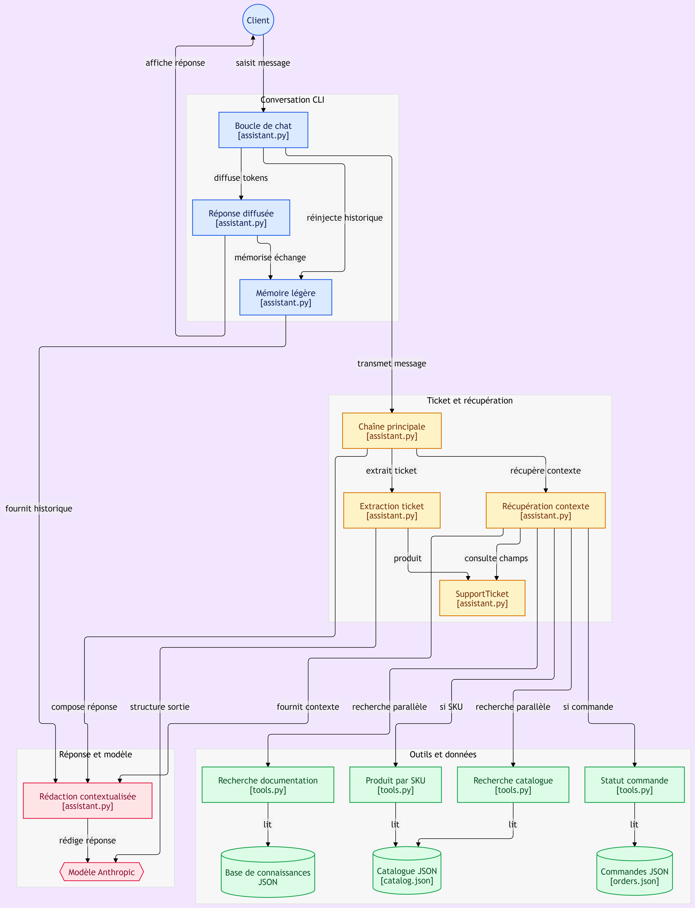

# Assistant de support Randoneo

Un assistant de support en ligne de commande pour Randoneo, une boutique
d'équipement outdoor. L'assistant comprend les questions en langage naturel,
consulte les vraies données (catalogue, commandes, documentation) et répond
de manière fiable et contextualisée.

## Statut du projet

✅ **Fonctionnel** — Toutes les fonctionnalités sont opérationnelles.

## Fonctionnalités

- **Compréhension** : extraction d'un ticket structuré (intention, n° de commande, SKU)
- **Récupération** : appel des outils selon le ticket (commande, produit, recherche)
- **Rédaction** : réponse ancrée uniquement sur le contexte récupéré
- **Mémoire** : l'assistant garde le fil de la conversation
- **Streaming** : la réponse s'affiche token par token

## Installation

### 1. Cloner le projet

```bash
git clone https://github.com/hocine-drioueche/randoneo-assistant.git
cd randoneo-assistant
```

### 2. Créer un environnement virtuel

```bash
python -m venv .venv

# Linux/Mac
source .venv/bin/activate

# Windows
.venv\Scripts\activate
```

### 3. Installer les dépendances

```bash
pip install -r requirements.txt
```

### 4. Configurer la clé API

Crée un fichier `.env` à la racine du projet :

```bash
cp .env.example .env
# Puis édite .env avec ta vraie clé Anthropic
```

### 5. Vérifier les données

Les fichiers `data/catalog.json`, `data/orders.json` et
`data/knowledge_base.json` doivent être présents.

## Utilisation

```bash
python assistant.py
```

Puis pose tes questions :

```
> Quelle tente légère conseillez-vous pour 2 personnes en bivouac ?
> Et en 3 places ?
> Où en est ma commande RND-10234 ?
> Et la commande RND-99999 ?
> quit
```

## Tester les outils isolément

```bash
python tools.py
```

Cela teste les 4 outils (`get_order_status`, `get_product`, `search_catalog`,
`search_knowledge_base`) sur des exemples.

## Architecture

```
randoneo-assistant/
├── assistant.py        # Chaîne + boucle de chat
├── tools.py            # Les 4 outils
├── data/               # Les données JSON
│   ├── catalog.json
│   ├── orders.json
│   └── knowledge_base.json
├── docs/               # Documentation (images)
│   └── pipeline.png
├── requirements.txt
├── .env                # Clé API (non commité)
├── .env.example        # Modèle
└── README.md
```

## Architecture visuelle



*Le pipeline : comprendre → récupérer → rédiger, avec mémoire.*


### Architecture détaillée



*Vue complète : conversation CLI, chaîne d'orchestration, outils, données et modèle.*

## Comment ça marche

1. **Extraction** : le message est transformé en `SupportTicket` (Pydantic)
2. **Récupération** : selon le ticket, on appelle le bon outil
3. **Rédaction** : le prompt impose de s'appuyer uniquement sur le contexte
4. **Mémoire** : l'historique léger est réinjecté dans le prompt

## Compétences mobilisées

- **LangChain / LCEL** : composer des runnables avec `|`
- **RunnablePassthrough.assign** : assembler la chaîne
- **Sortie structurée** : `with_structured_output` + Pydantic
- **RunnableParallel** : recherche catalogue + base de connaissances
- **Mémoire de conversation** : un historique léger réinjecté
- **Streaming** : afficher la réponse au fil de l'eau

## Auteur

Hocine Drioueche — [drioueche.hocine@gmail.com](mailto:drioueche.hocine@gmail.com)

